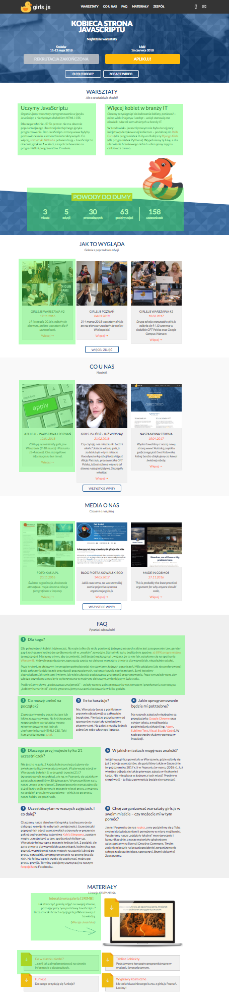

# Strona girlsjs.pl

Strona jest oparta o generator statycznego contentu [hexo](http://hexo.io).

## Uruchamianie lokalnie  

### Wymagania systemowe:
Wymagany jest zainstalowany node.js, najlepiej w wersji LTS.

### Instalacja

1. `git clone git@github.com:girlsjs/www.git`
1. `cd www`
1. `npm install` lub `yarn` - instalacja zależności
1. `cd pl` - przejście do katalogu z polską wersją językową
1. `npm install` lub `yarn` - instalacja zależności konkretnej wersji językowej
1. `cd themes` - przejście do katalogu templatek
1. `git clone git@github.com:girlsjs/www-theme.git` - instalacja templatki
1. `cd ..` - wracamy do katalogu `pl`

### Uruchamianie w trybie developerskim

`yarn hexo server` - z poziomu katalogu `pl`, wystartuje serwer developerski pod adresem `http://localhost:4000`


## Treść

Hexo wykorzystuje 2 typy treści

1. `posts` - posty wyświetlane zbiorczo np. na stronie głównej
2. `pages` - osobne podstrony, np. `zespół`

Poniższa grafika prezentuje poglądową informację, co jest postem na stronie głównej (na zielono)



### Struktura katalogów

```
pl/
  source/ - główny katalog z treścią strony
    _posts/ - katalog z postami
      blog/ - katalog z postami blogowymi (newsy)
      galleries/ - katalog z postami galerii
      materials/
      media/
      panel-faq/
      panel-proud/
      panel-workshop/
      team/ - katalog z członkami zespołu
    images/ - katalog obrazków
      gallery/ - galerie
      partners/ - partnerzy do stopki
      posts/ - zdjęcia do postów
      team/ - członkowie zespołu
    team/ - podstrona zespołu
```

Posty muszą znajdować się wewnątrz katalogu `_posts`. Katalogi wewnątrz są tylko i wyłącznie dla uporządkowania treści, gdyż
hexo nie bierze ich pod uwagę.

Strony umieszczane są we własnych katalogach wewnatrz katalogu `source/`

### Pliki

Każdy plik treści składa się z metadanych opisanych w formacie YAML oraz contentu strony opisanego w formacie markdown.

Przykładowy plik wygląda w ten sposób

```
---
title: Tytuł strony lub postu
date: 2017-04-15
categories: blog
description: Krótki opis (np. zajawka postu)
---

Tutaj treść strony lub postu w formacie markdown
```

Przy dodawaniu nowych postów, bardzo ważne są 2 rzeczy

* Prawidłowe dodanie kategorii - ponieważ to na podstawie kategorii rozpoznawany jest typ postu i gdzie ma on zostać
  umieszczony na stronie, tzn, czy jest to news, czy galeria, czy element faqu. Dostępne kategorie to:
    * `blog`,
    * `gallery`,
    * `media`,
    * `panel-materials`,
    * `panel-faq`,
    * `panel-proud`,
    * `panel-workshop`,
    * `team`

* Odpowiednia nazwa pliku, tak aby pasowała do pozostałych plików, tzn:
  * `YYYY-MM-DD-tytul-postu.md` - dla kategorii `blog` oraz `media`
  * `nazwa-postu-NR.md` - dla pozostałych kategorii - tutaj bardzo istotne jest podanie numeru `NR` na podstawie którego
    content będzie sortowany

### Metadane

W zależności od typu postu lub strony, wykorzystywane są różne metadane. Najprościej, przy tworzeniu nowego wpisu,
użyć istniejącego już podobnego wpisu, jako szablonu. Poniżej znajdują się wyszegółowione metadane przyjmowane przez
konkretne typy wpisów:

#### Blog (newsy)

* `title` - tytuł
* `date` - data wpisu (sortowanie po dacie)
* `categories: blog`
* `description` - którki opis do wyświetlenia na stronie głównej
* `image` - nazwa obrazka do newsa, brany z katalogu `source/images/posts`

#### Galleries (galerie)

* `title` - tytuł
* `date` - data (sortowanie po dacie)
* `categories: gallery`
* `directory` - nazwa katalogu w `source/images/galleries` np: `poznan-1`
* `description` - opis
* `collage` - lista 4 nazw zdjęć do kolażu na str. głównej
* `photos` - lista wszystkich zdjęć z katalogu (todo będzie poprawione)

#### Materials (materiały)

Pierwszy post z tej kategorii zostanie wyświetlony jako główny post (`Interaktywna galeria [190MB]!`)

* `title` - tytuł
* `categories: panel-materials`
* `url` - odnośnik do materiału

#### Media (media o nas)

* `title` - tytuł
* `date` - data wpisu (sortowanie po dacie)
* `categories: media`
* `description` - którki opis do wyświetlenia na stronie głównej
* `image` - nazwa obrazka do newsa, brany z katalogu `source/images/posts`

#### Panel FAQ

* `title` - tytuł
* `categories: panel-faq`
* `columns` - liczba kolumn w wierszu FAQa, dostępne `1` - cały wiersz, `2` oraz `3`

#### Panel proud (powody do dumy)

`panel-proud` ma tylko jedną instancję, nie posiada treści właściwej tylko metadane.

* `title` - tytuł `Powody do dumy`
* `categories: panel-proud`
* `cities` - ile miast
* `editions` - ile edycji
* `trainers` - ile trenerów
* `hours` - ile gordzin
* `attendees` - ile uczestniczek

#### Panel workshop (warsztaty)

* `title` - tytuł
* `categories: panel-workshop`
* `description` - podtytuł

#### Team

Posty z kategorii `team` nie są wykorzystywane na stronie głównej tylko na podstronie zespołu.

* `title` - imię i nazwisko
* `categories: team`
* `image` - nazwa pliku z katalogu `source/images/team/`
* `city` - miasto, jedno z: `warsaw`, `poznan`, `cracow`, `lodz`, `szczecin`
